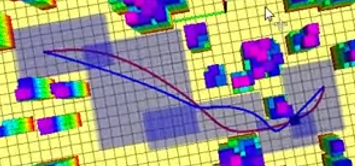
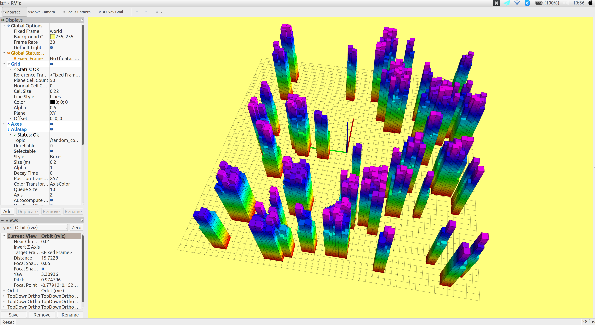

# Path-planning
浙江大学17级交叉班机器人学交叉创新课程大作业。课程题目为无人飞行器的基础路径规划问题，供

学弟和学妹参考学习。

# 功能实现：

项目主要是分为两个部分：路径规划+轨迹生成。

在路径规划部分，使用了三种方法来做路径规划，分别为A星，JPS和RRT星，默认使用的A星，当然也可以实现切换，切换的CPP文件为src/grid_path_searcher/src/demo_node.cpp

而在轨迹生成部分，使用了两种方法，分别是传统的mini-snap轨迹生成和飞行走廊结合贝塞尔曲线轨迹生成。默认是使用后者，因为他的效果远远好于前者。经过测试，每次运行时间不多于15ms

下图是对比结果。




蓝线代表minisanp轨迹，红线代表贝塞尔曲线轨迹，由此可见红线要顺滑很多。

# 如何运行

## 环境要求

项目用到了ROS和二次求解OOQP库，所用的系统为ubuntu16.04

1、安装ros,  http://wiki.ros.org/ROS/Installation

2、安装OOQP http://pages.cs.wisc.edu/~swright/ooqp/

除此以外，没有任何第三方库的要求。

## 运行步骤

强烈建议您自己新开一个工作区。

```bash
cd ~/your_catkin_ws
git clone https://github.com/Han-Sin/Path-planning
cd Path-planning
catkin_make 
source devel/setup.bash
roslaunch grid_path_searcher demo.launch
```

如果能出现如下界面，则您成功了。




之后仓库和README也会持续更新，这个仓库可能将作为之后笔者做目标跟踪的课题的仓库，待课程出分后，论文和PPT将会被添加至仓库。

有任何问题欢迎联系：

1228994385@qq.com 或者 517675667@qq.com


